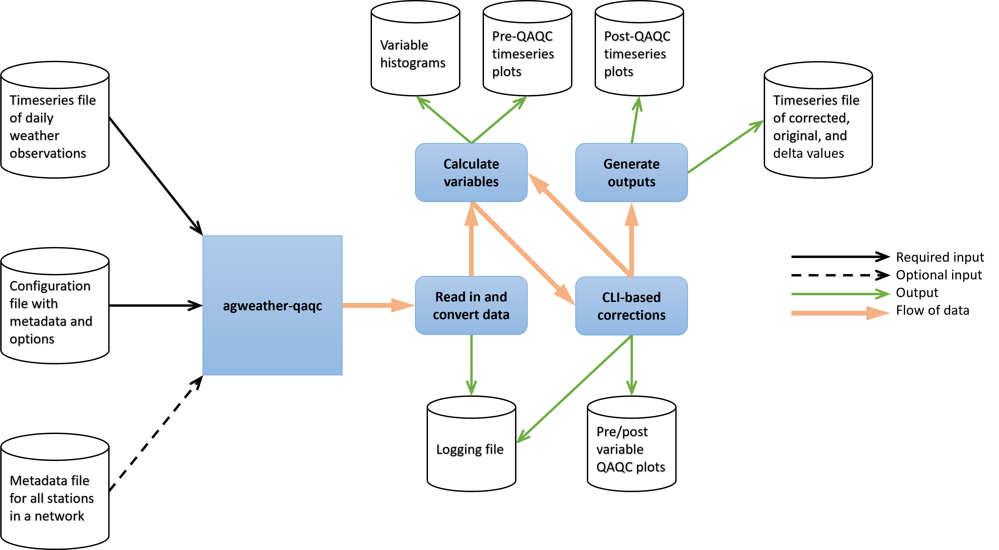

# Introduction

Agricultural weather stations are necessary for collecting representative observations needed for computing reference evapotranspiration (ET), a measure of atmospheric evaporative demand from a well-watered environment, and a key variable for determining crop water use, water requirements, and irrigation scheduling [@allen1998]. Common weather station measurements include near-surface (2 to 3 m height) measurements for incoming shortwave solar radiation, air temperature, humidity, wind speed, and precipitation. Accurate, continuous, and consistent measurement of these variables from years to decades is often lacking due to sensor malfunction, drift, age, poor calibration, debris, limited station maintenance, communication errors, lack of a well-watered environment, and remote access. As a result, poor quality agricultural weather station data are common, and, unless flagged for removal or corrected, will impact the accuracy of reference ET calculations [@allen1996]. Ensuring that agricultural station data are high quality is especially important for studies where station data are considered to be ‘truth’ when comparing to related model predictions and forecasts [@blankenau2020; @mcevoy2022]. Similarly, reference ET station data need to represent well-watered environments if they are to be used to validate or to bias-correct gridded reference ET datasets [@allen2021; @huntington2018]. 

Agricultural weather station data are increasingly being used to support satellite-based remote sensing of agricultural water use. The weather data are often collected from dozens of networks and hundreds of stations and requires large-scale quality assurance and quality control (QAQC) systems to ensure accuracy and representativeness [@melton2022; @huntington2022]. A common challenge has been the development of QAQC workflows and visualization tools to support implementation of recent advances in recognizing and correcting data error. Reliable, high-quality records of weather observations will become even more important as scarcity in freshwater resources continues to become a more prevalent issue in the world [@steduto2012; @kummu2016].

# Statement of Need

Having the ability to easily read, visualize, review, flag, and potentially remove, fill, or adjust historical and real time weather data is necessary to advance research and applications focused on evapotranspiration and water use estimation at local to global scales. The development of the ``agweather-qaqc`` Python package is intended to enable rapid, thorough, and efficient weather data review and QAQC for daily weather data. The ``agweather-qaqc`` package is a command-line interface (CLI) based, open-source Python package for reading, visualizing, and performing QAQC of daily weather station observations and calculation of reference ET from a wide range of data networks. Many station networks use different storage formats and recorded variables. For example, a network might report humidity data as vapor pressure, dew point temperature, or maximum, minimum, and average relative humidity.  ``agweather-qaqc`` is able to flexibly handle multiple common input variables, units and formats so that all input data, visualization, QAQC, and calculation of reference ET can be performed in a programmatic, consistent, and easily repeatable manner. Additionally, the CLI-based approach enables researchers and practitioners that are not overly proficient with Python to easily use and understand the software through the use of helpful reminders, prompts, and recommended parameters. While this package was written with a focus on agricultural stations, it can be used to QAQC any source of weather data, but care must be taken when making corrections or drawing conclusions about reference ET.

# State of the Field
``agweather-qaqc`` builds on the concepts and functionality of the Ref-ET Software [@allen2000], which performs QAQC of data and calculates ASCE reference ET. ``agweather-qaqc`` builds on these capabilities, is open source, streamlines the processing of data, and increases accessibility by operating outside the Windows platform. Open source access also allows for the inclusion of additional methods and options. Other packages that have been developed, such as the R package [CrowdQC+](https://github.com/dafenner/CrowdQCplus) and the python library [titanlib](https://github.com/metno/titanlib), feature statistics-based QAQC of data, however they focus on spatial variation between multiple sources to detect outliers. ``agweather-qaqc`` differs from these libraries by focusing on the temporal variation within a single source.

# Research Enabled by ``agweather-qaqc``
This software was used to generate a benchmark agricultural weather station reference ET dataset for intercomparison and bias correction of a gridded weather dataset, gridMET [@abatzoglou2013] as part of OpenET [@melton2022], an online platform that provides satellite-based actual ET estimates at field scale across the western United States. This software has also been used to generate datasets of reference ET for weather stations in the Upper Colorado River Basin (UCRB) as part of a yearly Bureau of Reclamation publication of agricultural consumptive uses and losses [@pearson2019; @pearson2020; @pearson2021], intercomparison of OpenET models for the UCRB [@huntington2022], and was used in a skill analysis of NOAA’s Forecast Reference Evapotranspiration [@mcevoy2022].

# Design and Features

The ``agweather-qaqc`` package contains the WeatherQC python class that first reads and standardizes the data, and then allows the user to QAQC the data (\autoref{fig:fig1}).

Inputs to ``agweather-qaqc`` are a tabular data file of daily data and a configuration file that details where variables are arranged within the data file. The configuration file also provides metadata about the station, such as latitude, longitude, elevation, and units of the variables. An optional input of a metadata file for multiple stations may also be provided, enabling a single configuration file to be used for any number of data sources that share a common format. 

The ``agweather-qaqc`` package contains [example files](https://github.com/WSWUP/agweather-qaqc/tree/master/tests/test_files) of each input.

Once given data, the WeatherQC class performs unit conversions and removal of unreasonable values according to limits and ranges specified in the [documentation](https://wswup.github.io/agweather-qaqc/), (e.g., negative wind speed readings). This is followed by calculating variables, including ASCE reference ET, mean monthly averages, and other diagnostic metrics. Command-line interface (CLI) prompts facilitate corrections on desired variables, and provides recommendations as to best practices. All downstream dependent variables are recalculated once each correction is performed to assemble the quality-controlled version of the data. Once the user is finished making adjustments, output files are generated that include records of all changes through both a human-readable log file and interactive time series plots of pre- and post-processed observations. The generated output files form a complete record of original and processed observations with correction flags and amounts and station metadata so that a documented data archive is available for later use.

Two optional functionalities can be enabled by the configuration file: The first automates some of the interactive prompts to use the suggested QC procedures and parameters at each step. The second provides options for gap-filling using station climatologies, empirical approaches (e.g. Thornton-Running solar), or random sampling from observations, to provide a complete record of daily reference evapotranspiration for cumulative monthly and annual totals.

One of the most useful features of the software is the interactive visualization of weather variable time series that facilitate rapid human data assessment and pattern recognition.The observation data are displayed in [Bokeh](https://github.com/bokeh/bokeh) [-@Bokeh] time series plots both before and after adjustment via the QAQC process, enabling users to readily visualize and assess data patterns and trends related to sensor drift, probable miscalibration, data outliers, sensor malfunction, etc. These plots are accompanied by interactive tools (ex. pan and zoom controls, display info on hover), and feature linked axes, allowing the user to readily visualize and assess how variables vary and covary over time and at different time scales (e.g. daily, monthly, or annual). These graphs are saved as stand-alone HTML files to allow for easy sharing of results.

The interactive plots also facilitate viewing data patterns at different timescales, such as showing how minimum temperature and dew point temperature vary at daily and monthly timesteps, as well as how the difference in these variables, known as dew point depression, varies throughout the year. Dew point depression gives insight to how well-watered the area around the station may be: transpiration from plants and evaporation from soil increases humidity, which results in increased dew point and reduced dew point depression. Higher than expected or abrupt changes in dew point depression values might indicate non-ideal reference ET station siting, land cover changes, or erroneous data.

In addition to already described process, ``agweather-qaqc`` also performs the following steps:

* Calculation of theoretical clear-sky solar radiation using date, location and elevation information along with humidity data based on ASCE standardizations [@asce-ewri2005].
* Calculation of expected solar radiation using the empirical Thornton-Running approach [@thornton1999] with Monte-Carlo optimized empirical parameters based on observed solar radiation data.
* Calculation of the daily dew point depression (i.e., daily minimum temperature minus daily average dew point temperature) used to assess whether the data collection environment included a well-watered surface having expected feedbacks on near-surface humidity and air temperature.
* Calculation of grass and alfalfa reference evapotranspiration according to the American Society of Civil Engineers (ASCE) Standardized Reference Evapotranspiration equation [@asce-ewri2005] via the [RefET](https://github.com/WSWUP/RefET) [@RefET] library.
* Evaluating station aridity through the visualization of both relative humidity and dew point depression plots, with the option to adjust relative humidity if required.
* Creating archival charts and log files that record and flag how each variable was changed during the QAQC process.

The [documentation](https://wswup.github.io/agweather-qaqc/) provides more detail on these features and includes a tutorial with usage examples. An environment.yml is included for installation and third-party package management.

# Selected Example

Inaccuracies in measured incoming shortwave solar radiation (R~s~) are common due to pyranometer calibration drift, non-level baseplate, sensor degradation, and sensor obstructions or debris covering the sensor (e.g. accumulated dust or residue).

``agweather-qaqc`` can be used to visualize measurements of R~s~ with respect to theoretical clear-sky R~s~ (R~so~). A common use of ``agweather-qaqc`` is to perform corrections of measured R~s~. Corrections are performed by dividing the record into specified periods of time (e.g., 60 days), and comparing R~s~ measurements for specified periods against R~so~, which is a function of day of year, atmospheric water vapor, elevation, and latitude [@allen1996]. R~s~ should approach R~so~ when a cloud-free day occurs, and potentially slightly surpass it due to incident reflected R~s~ (e.g., distant cloud that doesn’t obstruct sunlight) [@asce-ewri2005]. 

It is expected that a cloud-free day should occur with some regularity for areas with significant agriculture, especially in semi-arid and arid areas. In this example time series (\autoref{fig:fig2}), observed R~s~ from before July 2013 frequently approaches R~so~, and after this time period, R~s~ rarely approaches R~so~, especially during summer and winter months, indicating that the pyranometer is likely reporting inaccurate values and that observed data should be adjusted.

![Observed shortwave radiation (top) compared against expected clear-sky solar radiation for a weather station in Reno, Nevada. The downward drift in the sensor readings over the four year period is made obvious by comparing against the theoretical clear-sky values. Post-QC shortwave radiation (middle) compared against clear-sky solar radiation, the downward drift has been adjusted back to the expected behavior of R~s~. The percent difference (bottom) between pre- and post-QC R~s~ values as a result of applying the $\frac{R~so~}{R~s~}$ correction factor ratio to each sixty-day period..\label{fig:fig2}](figure2.png)

To perform the adjustment, measured R~s~ data are parsed into 60-day periods. Each period is first checked for [bad or suspect values](https://wswup.github.io/agweather-qaqc/agweatherqaqc.html#agweatherqaqc.qaqc_functions.rs_period_ratio_corr), and then the ratio of R~so~ to R~s~ is calculated from the average of the six largest daily R~s~ observations and corresponding R~so~ values (i.e. top 10 percentile for the 60-day period). This ratio is multiplied by all R~s~ measurements during the respective 60-day period to correct measured R~s~ data. If the R~so~ to R~s~ ratio is between 0.97 and 1.03, no adjustment is applied. The length of period and number of largest R~s~/R~so~ ratios (e.g. percentile threshold) to compute average adjustment ratios for the respective period are configurable through interactive prompts.

After adjustment of R~s~ is performed, a time series plot of percent difference between pre- and post-corrected R~s~ is produced for visualization and archiving adjustments made. If faulty R~s~ observations had not been adjusted, reference ET would be underestimated in this case by approximately 5%. This example highlights how ``agweather-qaqc`` can be used to visualize and correct weather variables to improve evaporative demand estimates.

# Limitations:

* Recommendations are made for procedures and default parameters to use, but the end user is ultimately responsible for specifying parameters and corrections made.
* Knowledge about the station metadata is required, such as latitude, elevation, anemometer measurement height, and any field conditions potentially compromising data quality (e.g. tree located next to station obstructing wind speed and R~s~ measurements, dryness of the weather station environment).
* If the weather station is not located over a well-watered surface according to ASCE guidelines, reference ET will likely be overestimated [@singh2023].

# Co-author Roles

``agweather-qaqc`` was developed through the following efforts:

  * Christian Dunkerly: Principal developer and maintainer of the repository. 
  * Justin Huntington: Provided project direction, advised on scientific foundation of work, and suggested features.
  * Richard Allen: Advised on scientific foundation of work and reviewed methodologies.
  * Daniel McEvoy: Provided additional project direction and suggested features.
  * Asa Morway: Wrote tests and provided feedback on user experience.

# Acknowledgements

We would like to thank the Bureau of Reclamation, NASA Applied Sciences Program, and the Western States Water Use Program at the Desert Research Institute for providing funding for the development of this software. We would like to thank the ASCE-EWRI Technical Committee on Evapotranspiration in Irrigation and Hydrology for promoting the development and application of QAQC procedures and standardization of reference ET calculation. We would also like to thank John Volk, David Ketchum, and Charles Morton for their technical expertise. 

# References